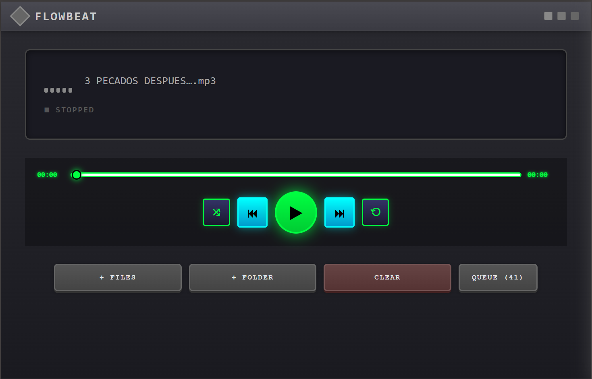

# FlowBeat Player

Un reproductor de música moderno con interfaz retro-futurista desarrollado con React, Vite y Electron.



## Características

- Reproducción de archivos MP3, WAV, OGG y M4A
- Importación de archivos individuales o carpetas completas
- Controles de reproducción (play/pause, anterior, siguiente)
- Modos de reproducción (repetición y aleatorio)
- Lista de reproducción con persistencia entre sesiones
- Interfaz de usuario con estilo retro-futurista

## Instalación

### Requisitos previos

- [Node.js](https://nodejs.org/) (v16 o superior)
- [Bun](https://bun.sh/) (opcional, para mejor rendimiento)

### Pasos de instalación

1. Clona el repositorio:

```bash
git clone https://github.com/tuusuario/FlowBeat_Player.git
cd FlowBeat_Player
```

2. Instala las dependencias:

```bash
# Con npm
npm install

# O con bun
bun install
```

## Uso

### Modo desarrollo

Para ejecutar la aplicación en modo desarrollo:

```bash
# Con npm
npm run dev:electron

# En Windows
npm run dev:electron:win

# Con bun
bun run dev:electron
```

### Construir para producción

Para generar una versión de producción:

```bash
# Con npm
npm run dist

# Con bun
bun run dist
```

## Estructura del proyecto

```
FlowBeat_Player/
├── electron/           # Código de Electron (proceso principal)
│   ├── main.js         # Punto de entrada de Electron
│   └── preload.js      # Script de precarga para IPC seguro
├── src/                # Código fuente de React
│   ├── components/     # Componentes de UI
│   ├── hooks/          # Hooks personalizados
│   ├── App.jsx         # Componente principal
│   └── main.jsx        # Punto de entrada de React
└── ...                 # Archivos de configuración
```

## Licencia

Este proyecto está licenciado bajo la [Licencia MIT](LICENSE.txt).

## Autor

Juan Manuel López Arrieta
